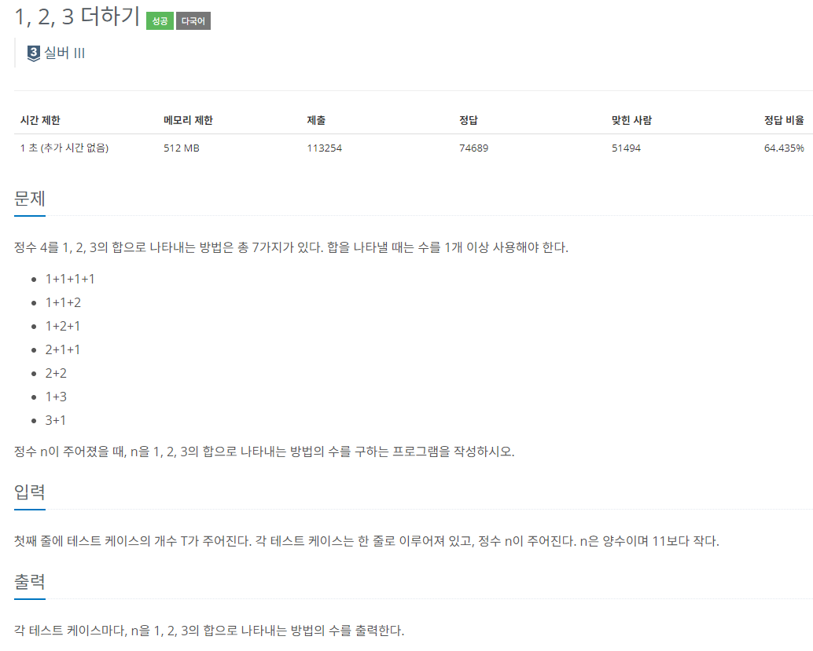

### 문제 해결
- 문제 예시에서 많은 힌트를 얻었다.
> - 3의 경우의 수에서 +1하면 4 / 2의 경우의 수에서 +2씩 하면4 / 1의 경우의 수에서 +3하면 4 
   > - 즉, Q(n) = Q(n-1) + Q(n-2) + Q(n-3)

dp문제를 조금씩 풀다보니 점화식이 생기는 상황이 눈에 보이기 시작한 것 같다. 
좀더 난이도 있는 문제를 풀어봐야겠다.
