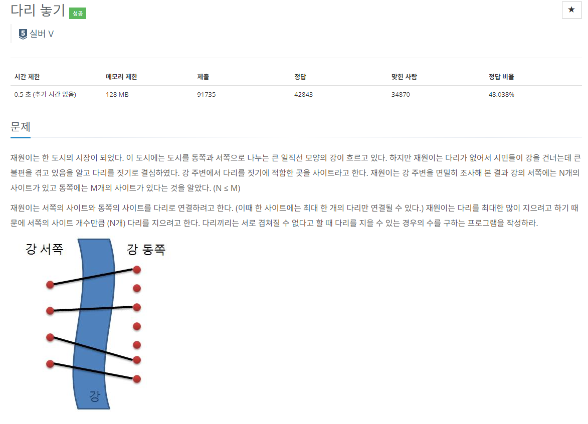

### 문제해결
- 해당 문제는 조합을 이용하면 간단한 문제이다. 조합 계산은 쉽게 하였지만 프로그래밍으로 해본적이 없어 구현에 약간의 어려움이 있었다.
- 특히 계산식 그대로 적용하면 되지 않을까 생각하고 그대로 구현하였다. 
- 하지만 생각보다 코드가 길어지고 답이 잘 나오지 않았다. 아마 그대로 구형하였어도 정답은 나왔을 것이라 생각된다.
- 그래서 고등학교때 배운 조합의 특징으로 계산 된 값들을 기억하고 꺼내쓰는 DP 알고리즘으로 해결하였다.
- 조합의 공식으로는 `nCr = (n-1)C(r-1) + (n-1)Cr` 이다.
- 해당 문제의 알고리즘은 나중에 유용하게 사용할 것 같아서 외우도록 하겠다.