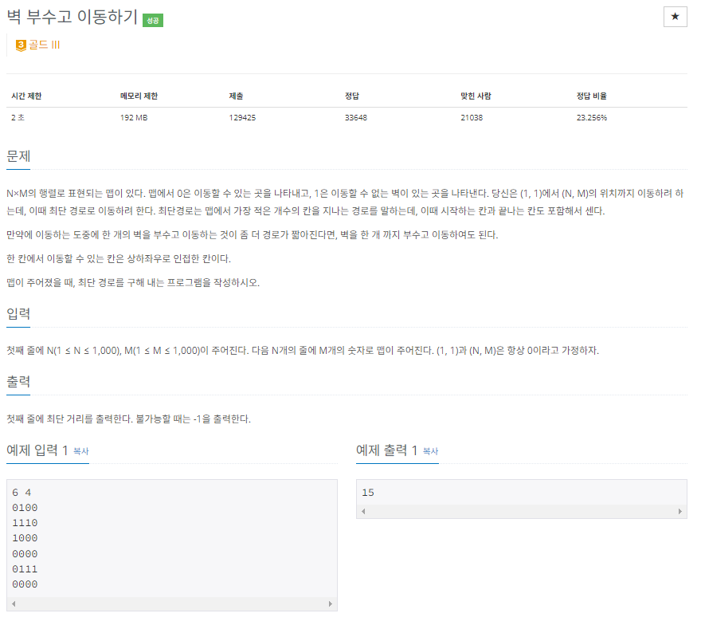

- 처음에 지나가는 모든 벽을 하나씩 0으로 바꾸고 BFS를 해보려했음 -> 시간 복잡도를 계산해 보니 어마어마함 -> x
- BFS의 시간 복잡도는 인접 행렬 : O(n^2) / 인접 리스트 : O(n+e) 
- 해당 문제는 모든 정정을 돌아가며 인접을 확인하는것이 아니라서 인접 리스트에 가까움
- 그래서 시간이 가능한가 했음 > 구현해보니 시간초과 > 벽이 너무 많아지면 시간복잡도가 많이 올라감
- 그래서 한번의 BFS를 진행할때 
  - 벽을 부쉈던 경로로 왔는지 확인 
  - 벽 X : 벽을 부신적이 없으면 `visited[][][0] = true` + queue에 해당 정보를 `add`
  - 벽 X : 벽을 부신적이 있으면 `visited[][][1] = true` + queue에 해당 정보를 `add`
  - 벽 O : 벽을 부신적이 없을때 `visited[][][1] = true` + queue에 해당 정보를 `add`
- 위 정보를 파악하기 위해 queue에 `add`하기위한 객체 `Loc`를 구현
- 객체에 정보를 저장해서 queue에 넣는다.

- `` 시간 복잡도 기준 : 1억(10^8) > 1초 ``
- O(N) :  100000000(1억 / 10^8)
- O(nlogn) : 10000000(10^7)
- O(n^2) : 10000(10^4)
- O(n^3) : 500