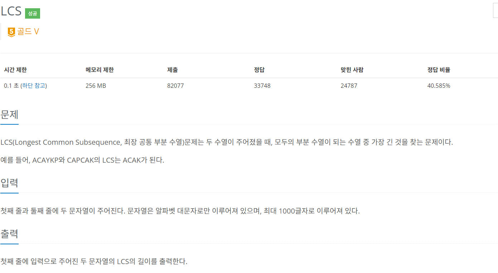

### 문제 해결
- 해당 문제는 유명한 문제인 `<최장 공통 부분 수열>`이다. LCS는 대학교 알고리즘 강의에서 처음 접했던 기억이 있었다.
- 하지만 오랜만에 LCS를 접하게 되어 기억이 잘 나지 않았다. 
- 예전에 배웠던 문제이다보니 자꾸 기억에 의존해서 풀려고하는 자신을 보게되었다.
- 기억으로만 문제를 풀면 문제해결 능력을 기를 수 없다고 생각하고 다시 문제를 바라보고 생각을 하였다.
- 예전에 배웠던 기억이 있어서 그런것일지 모르겠지만, 차분히 문제를 바라보니 해결방이 실마리를 발견하였고, 해결하게 되었다.
- 각 문자를 돌면서 같은 문자가 나올때 +1을 기록하며 답을 구하는 전형적인 동적프로그래밍 방법이다.
```
같은 문자열을 발견할때
lcs[i][j] = lcs[i][j] + 1

그 외
lcs[i][j] = lcs[i-1][j], lcs[i][j-1]중 큰 값
```
각 문자를 돌때 같은 문자를 발견하면 지금까지 수열의 +1을 하고, 그 외에는 이전의 최대 공통 부분길이와 지금 문자를 비교값중 큰값을 가져간다.
