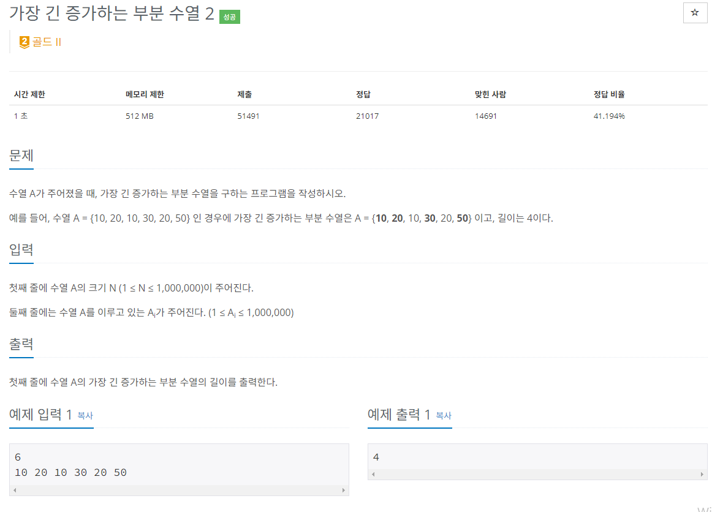

### 문제해결
- 가장 긴 증가하는 부분 수열은 대표적인 동적프로그래밍(DP)의 유형 알고리즘 문제이다.
- 하지만 DP로 문제를 해결하면 n^2 이라는 시간 복잡도를 가지게 된다. => 시간초과
- 이분탐색으로 해결가능, 시간복잡도가 O(nlogn)으로 전자보다 빠르다.
- 이분탐색로 해결한 방법은 수열을 돌면서 list에 값을 넣는다.
- 이때, 리스트의 마지막 인자 값 보다 크다면 그냥 add(), 
- 만약 더 작다면 이분탐색으로 해당 값이 list의 값이 들어갈 수 있는 (순서에 맞게) 위치와 변경한다.
- 이렇게 하면 기존의 증가하는 수열에서 더 긴 수열이 나오면 바로 대체가 가능하다.
- 해당 방법은 가장 긴 증가하는 부분 수열, 즉 수열 값은 중요하지 않고 길이가 중요하므로 가능한 방법이다.