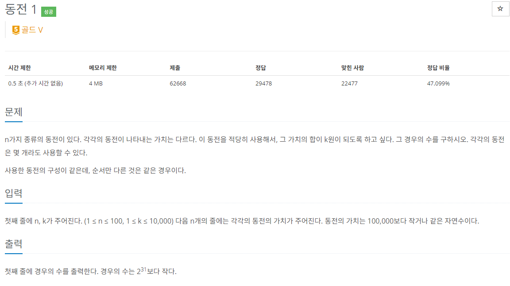

### 문제 해결
- dp 알고리즘-> 작은 문제 부터 해결하면서 메모제이션을 한다. -> 해결한 작은 문제들로 더 큰 문제를 해결한다.
- 해당 방식으로 `동전 1`문제를 해결하였다.
- 문제에서 주의해야할 조건이 있는데, 그것은 사용한 동전의 순서는 상관이 없다는 것이다.
- 해당 조건으로 확실하게 메모제이션을 해야했다.
- 사용한 방법은 각 동전의 가치마다 목표로하는 금액까지의 모든 값을 구하는 경우를 기록한다.
- 이때 신경써야할 부분은 n 값에서 현재 동전의 값을 뺀 값의 dp값 과 원래 있는 dp값을 더해주면 된다.
``` 
예를 들어 문제에서 3의 값의 경우의 수는 (1,1,1), (1,2) 2개이다. 
그리고 현재 비교하는 동전의 가치는 2이다. 그렇다면 3에서 2를 빼면 1이고 
dp[1]의 값과 dp[3]의 값을 더하는 것이다.
즉, 1원,2원 동전으로 표현한값 + 1원으로 표현한 값 이다.
