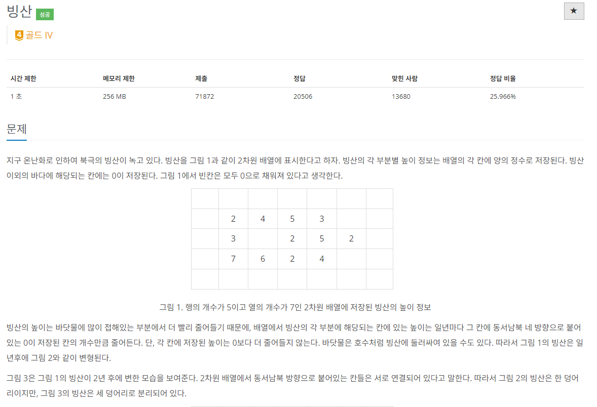

- DFS와 BFS둘 모두 이용해서 문제 해결
- DFS로 빙산 덩어리 개수를 구한다.
  - 만약, 1보다 크면 break로 나옴 -> 나오기까지 반복횟수(시간)을 체크
- BFS로 빙산이 녹는 상황을 계산한다.
  - 빙산 위치를 queue에 넣어 주변 바닷물을 계산한다.
  - 주위!!! 만약, 어떤 빙산이 계산후에 0이되어 바닷물이 된다면 옆을 계산하면서 바닷물 계산에 착오가 생김!!
  - 그래서 `boolean visited[]`으로 원래 빙산이였는지 체크