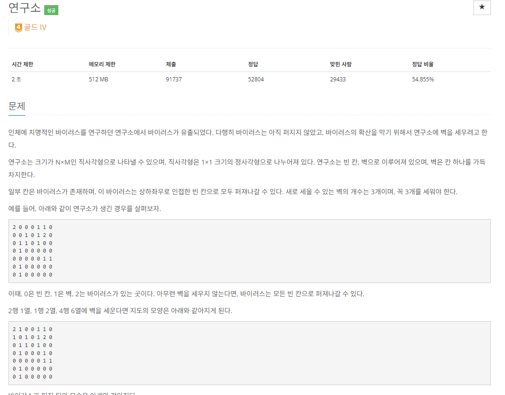

- 처음에 혼자서 풀지 못한 문제여서 다시한번 풀어보았다. 
- 이 문제는 3개의 벽을 결정하고 각 벽을 설정한 지도에서 안전구역을 확인하면 된다.
- 물론 3개의 벽을 설정하는데에도 많은 경우의 수가 존재하고, 그리고 각 상황에서의 안전구역을 계산하여 
- 최대 안전구역을 구해야함으로 많이 시간 복잡도가 예상된다.
- 하지만!! 제한된 벽 개수(3개) , 제한된 N 범위(3 ≤ N, M ≤ 8)이기 때문에 가능했다.
- 3개의 벽을 구할때에는 DFS로 3개의 벽을 탐색시 BFS로 바이러스가 퍼지는 상황을 만들고
- 이중 for문으로 map을 돌면서 안전구역( 숫자 0 )인 구역 개수를 계산했다.
- 그리고 벽을 계산하는 DFS 에서 벽을 만들고 (map[해당 위치] = 1) 계산한뒤 
- 다시 백트랙킹 => map[해당위치] = 0을 넣었다. 