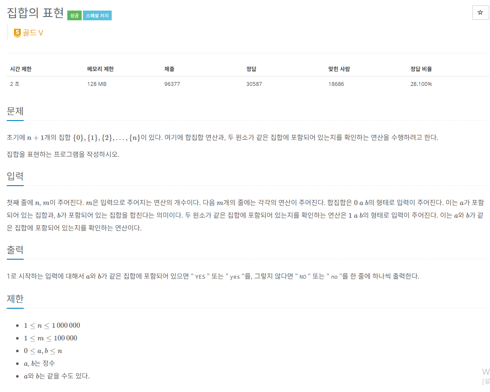

### 문제해결
- 해당 문제를 처음 풀때 각 n+1개의 LinkedList를 생성한뒤, 주어진 문자들이 있는 LinkedList끼리 합치는 방법을 떠올렸다.
- 사실 직관적인 방법으로서 구현하는 도중에 시간초과가 발생할 것 같았다. 하지만 끝까지 구현하였으나 역시나.. 시간초과 였다.
- 시간을 단축시킬 수 있는 알고리즘을 생각해 보았으나 역부족이였고 문제의 답을 찾아보았다. 
- 해당 문제는 유니온을 사용한 기본 문제였다.. 유니온 알고리즘은 사용해 본적이 전무해서 바로 공부를 해보았다.
> union이란 대표적 그래프 알고리즘으로 '합집합 찾기'라는 의미를 가지고 있다. 
>여러 노드가 존재할때, 두개의 노드를 선택해서 현재 두 노드가 서로 같은 그래프에 속하는 구하는 알고리즘이다.
>union알고리즘은 2가지 연산으로 이루어지는데, 바로 
>- find(x) : x가 어떤 집합에 포함되어있는지 판별
>- union(x,y) : x, y가 포함되어있는 집합을 합치는 연산

- 해당 문제를 위 2가지 연산으로 구현할때 배열을 사용하면 간단하게 표현할 수 있다. 
- index를 집합의 원소라고 생각하고 해결하면 간단하다.
- array[N]의 값은 각각의 0 부터 N-1개의 원소들의 부모를 가르키면 된다. 
- 좀더 구별하기 쉽게 각 집합의 최상위 원소를 구하면서 (재귀) 쉽게 비교할 수 있다.
