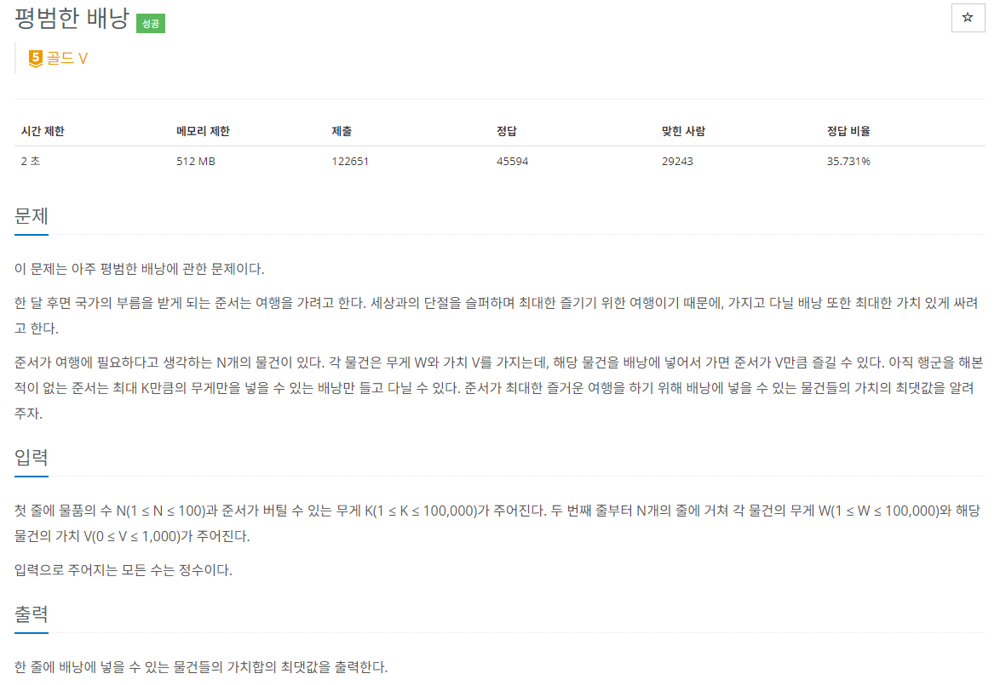

### 문제 해결
- 유명한 배낭 문제는 2가지 유형으로 나누어지는데,
> - 물건을 쪼갤 수 있는 Fraction KnapSpack Problem
> - 물건을 쪼갤 수 없는 KnapSack Problem
- 해당 문제는 `KnapSack Problem`문제로 대표적인 DP(동적 프로그래밍) 알고리즘 중 하나이다.
- 알고리즘을 살펴보면 담을 수 있는 최대 무게(W)인 배낭에 어떤 한 물건을 넣는다면,
- 다시 남은 물건과 최대 무게(W-넣은 물건 무게)를 구하게 되는 동적프로그래밍이다.
- 해석하자면, k+1번째 물건의 가치 + 그 물건의 무게 M을 뺀 (W-M)kgfh 1~k번의 물건으로 구할 수 있는 최대 가치를 구하는것이다.
- 사실, 해당문제를 계속해서 틀리게되어 검색을 해보았는데, dp의 대표적인 알고리즘으로 많은 예시가 나와있었다.
- 해당 알고리즘은 이해가 되었지만, 만약 내가 나중에 풀게 된다면 풀 수 있을지 모르겠다...
