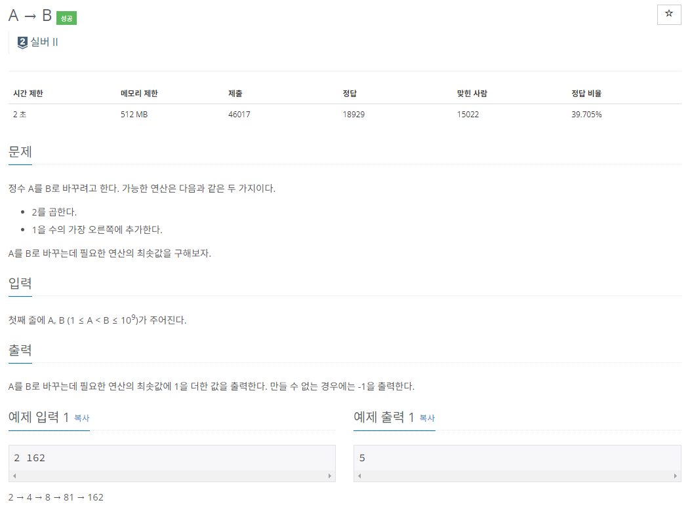

- 이 문제는 매 순간마다 
1. 2를 곱하거나 
2. 1을 수의 가장 오른쪽에 추가
- 를 계산하여 Queue 에 넣는 식으로 BFS로 구현하였다.
- 이젠 실버문제는 30분안에 풀린다.
- 처음 제출한 코드는 틀렸는데 Numberformat에러때문에 틀렸다.
- 입력값이 `1 <= A,B <= 10^9` 이여서 int형의 데이터 최대값이 21억인것을 생각해 문제가 없다고 생각했다.
- 하지만, 15억에서 위 연산을 진행하면 30억(int형 범위이상) , 151억(int형 범위이상)인 상황이 발생한다.
- 그래서 number를 long 자료형에 담아서 구현하였음.