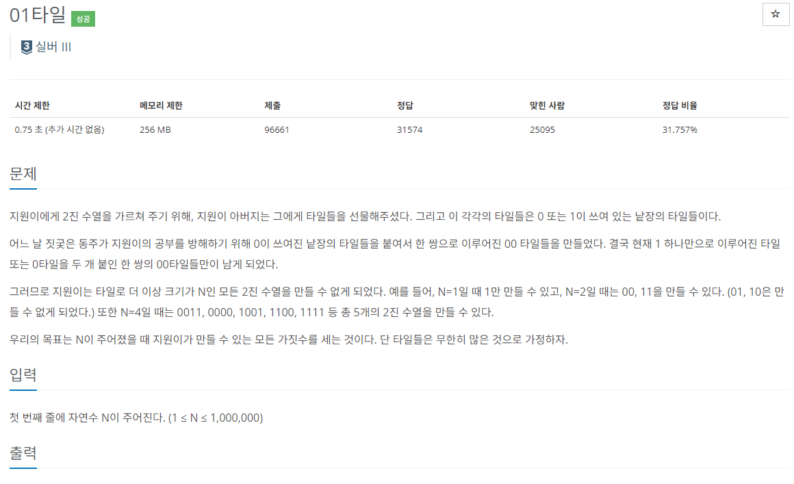

### 문제 해결
```
   N |  경우의 수
   1 :  1
   2 :  11, 00
   3 :  111, 100, 001
   4 :  1111, 1100, 1001, 0011, 0000
   5 :  11111, 11100, 11001, 10011, 00111, 10000, 00100, 00001
```
- N이 1일때, 2일때 경우의 수를 나열하보면 규칙이 보이는 전형적인 동적프로그래밍 알고리즘이다.
- 규칙을 살펴보면 N자리 값은 이전 값에서 1이 붙은 값 + 2번째 전에서 00이 붙은 값 이라는 것을 알 수 있다.
