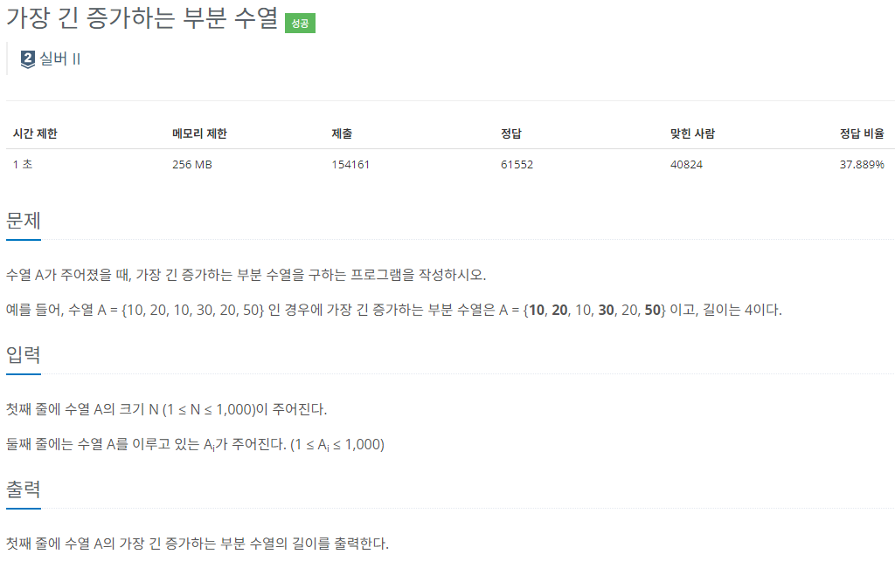

### 문제 해결
- 이중 for문으로 배열을 돌아가면서 자신 보다 작은 숫자일때, 해당 작은 값의 dp값 + 1이 현재 자신이 가지고 있는 dp값과 비교하여 더 큰값을 현재 dp에 넣는다.
- 그렇게 되면 이전에 탐색했던 내용을 기억하면서 다음 탐색과 비교 계산할 수 있다.
- 해당 문제에서 실수했던 부분은 가장 긴 증가하는 부분 수열이 맨 뒤에 있을 거라는 착각때문에 몇번 실패를 하였다.
