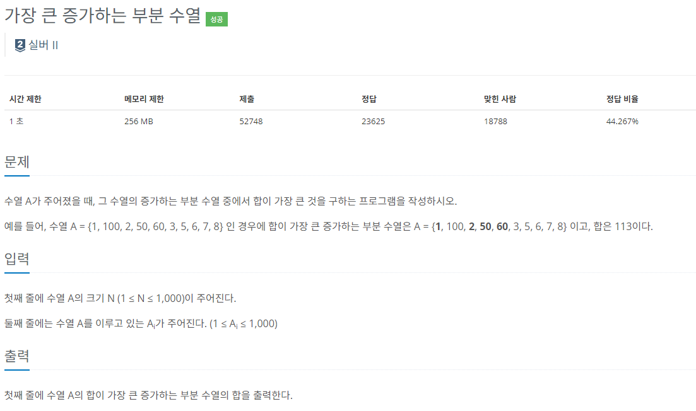

### 문제해결
```
LIS를 약간 변형해서 만든 문제이다. 
이 역시 DP(동적 프로그래밍)으로 작은 문제부터 해결하면서 점차 큰 문제들을 해결해 나갔다.

먼저 각각의 값을 저장할 배열 arr[][]를 생성 
이중 for문으로 돌아가면서 값을 비교, 비교가 되는 대상(수열값)보다 크다면,
 arr[i][j] = Math.max((arr[i][i] + input[j]), arr[i-1][j]);
으로 증가하는 부분 수열 중에서 합이 큰값을 구할 수 있다. 
그리고 배열의 마지막 행중 가장 큰값을 구하면 가장 큰 증가하는 부분 수열을 구할 수 있다. 

하지만 i-1값(이전값)을 가져오는 경우가 많아 첫번째 줄을 처리하는데에 오류가 생겨 그냥 깔끔하게 따로 처리하고 진행하였다.
```