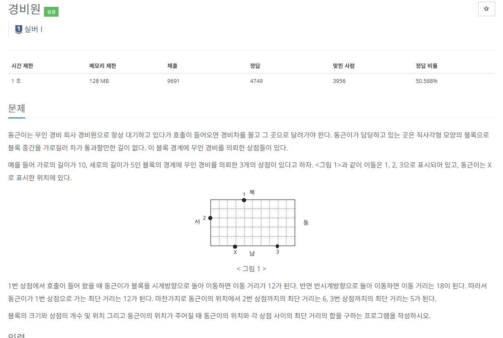

### 문제해결
- 구현 알고리즘으로 직접손으로 풀때에는 정말 간단한 계산 문제이다. 
- 하지만 알고리즘으로 컴퓨터에게 해결하려면 약간의 기준을 세워야한다.
- 먼저, 각각의 좌표가 서로 상대적이기때문에 일직선 상으로 만들필요가 있다.
  - 처음에 간단해 보여 별다른 설정 없이 if문으로 경우의 수를 처리하려했으나 생각보다 경우의 수가 많아 굉장히 복잡해졌다.
- 각 좌표를 시계방향으로 일직선상에 있다고 가정한다면, 이제 우리는 두가지중 작은 값의 합을 구하면 된다.
- 1. 두 값의 절대적인 차이
- 2. 일직선의 끝과 시작점이 이어져있을 때 해당 방향으로의 값 차이
- 위 두 차이중 작은 값을 더하면 최소거리를 알 수 있다.