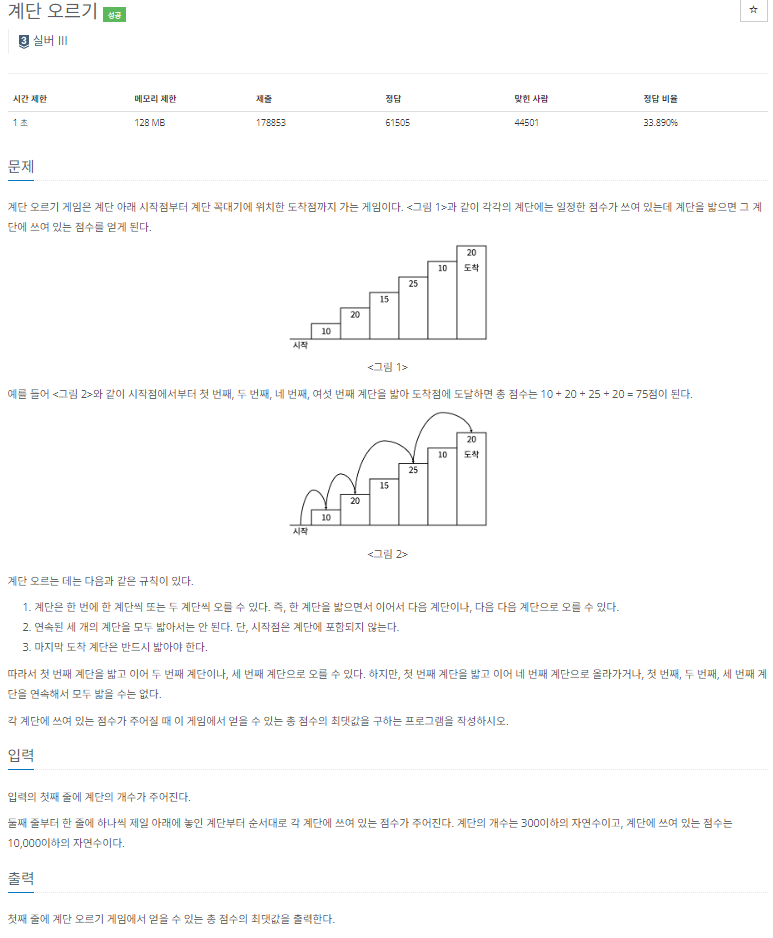

## 문제 해결 
- 문제 규칙 그대로 이문제는 연속된 세 개의 계단을 밟지않고 가장 큰 점수를 얻는 것이 목표이다.
- dp를 이용해서 앞에서부터 이전의 값들을 기억한뒤 가장 큰값을 기록하는 방법을 선택했다.
- 앞 두 계단이 연속으로 오지 않게 하기 위해 
```` java
for (int i = 3; i <= N; i++) {
  dp[i] = Math.max(dp[i - 3] + stairs[i - 1], dp[i - 2]) + stairs[i];
  }
````
위 코드를 사용해 세개의 계단이 연속되지 않게 하였다. 만약, 바로 앞과 두번째 앞의 값중 큰값을 선택해 현재 위치를 더했다면
3개의 계단이 연속하는 상황이 생길 것이다.
- 만약, 3보다 작은 숫자가 들어올 수 있기때문에 `dp[1]과 dp[2]를 따로 값을 설정하였다.`
- 이 문제는 점화식이나 해결방한이 떠오르지 않았다. 특히, 3개의 계단을 연속으로 선택하면 안되는 것이 나를 방해하였다.
- 그래서 다시한번 동적프로그래밍에 대해 검색하고 공부하였다. 