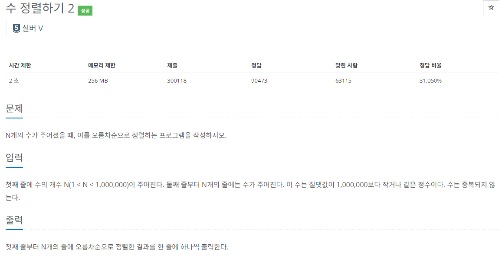

### 문제 해결
- 간단한 정렬문제이다.
- 하지만 해당 문제를 배열로 받아 Arrays.sort를 했지만 시간초과
- 검색해보니
>- `Arrays.sort`는 `DualPivotQuicksort`알고리즘을 사용해 최악(n^n), 평균 (nlogn)
>- `Collections.sort`는 `Timsort`알고리즘으로 최악,평균 모두(nlogn)
이렇듯 Collections.sort가 시간복잡도가 더 빠르다는 것을 알게되었고 Collections.sort를 사용해서 해결