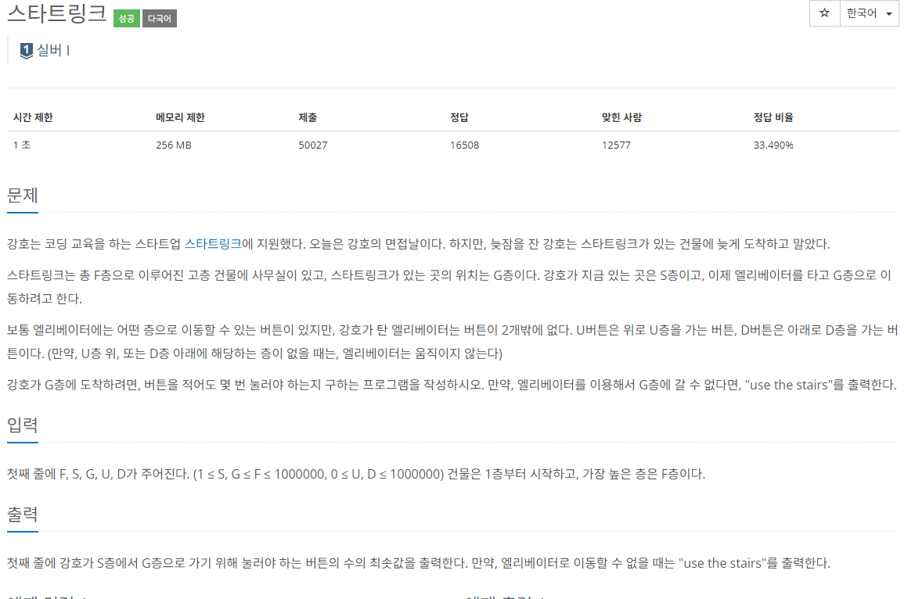

### 문제 해결 
- 문제에 나온 건물을 배열로 설정하여 배열의 인덱스로 각 층을 계산하였다.
- 해당 배열에서 BFS를 사용,
  - 위로 / 아래로 계산후 배열을 초과하는지 계산(0 < index <= 최고층)
  - `boolean visited` 으로 한번 방문했던 층은 갈 필요가 없으므로 체크
- 처음에 DFS로 해결하려했으나 데이터 최대값(1,000,000)입력시 스택오버플로우 발생하여 BFS로 해결
- BFS가 좋은듯 웬만하면 BFS로 하자
