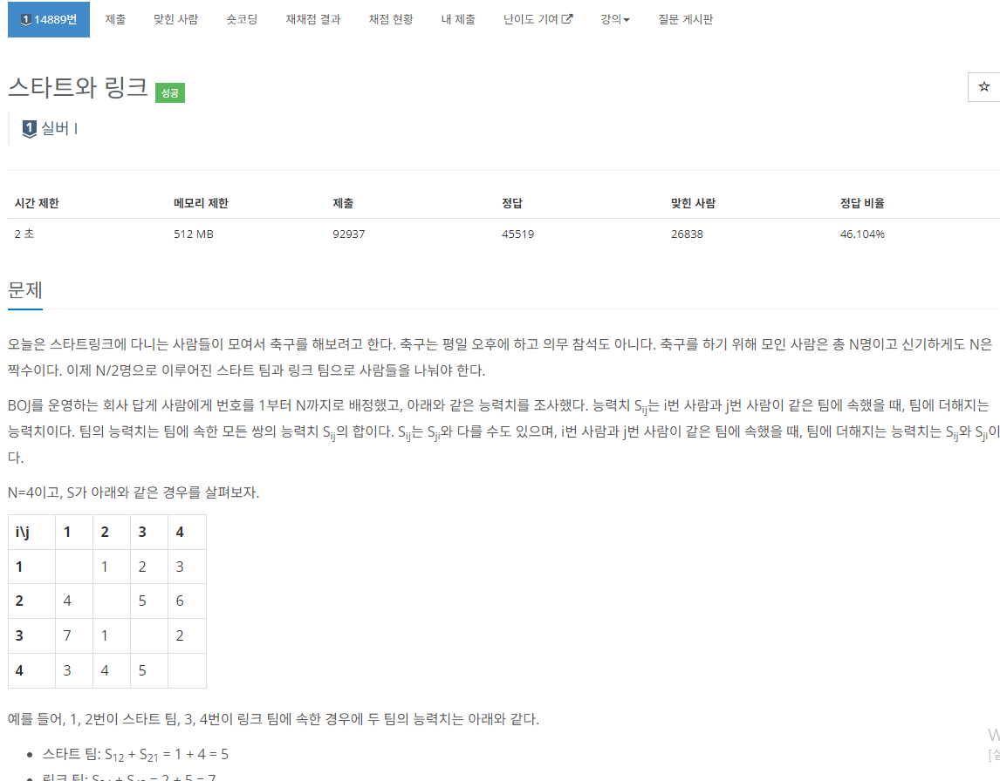

### 문제 해결 방법
- 이 문제는 완전탐색과 백트래킹을 사용해서 해결하는 문제이다.
- N명의 사람들을 두 팀으로 나누는 조합을 생각하고, 그 모든 조합시 나오는 최소값을 구하는 문제이다.
- 나는 처음에 DFS로 `List<Integer>`로 3명을 선택하면, 선택한 팀원들을 가지고 능력치를 계산하려고 하였다. 
- 내가 생각한 방법도 가능할 것 같지만, 코드의 길이가 늘어날 것 같은 생각이 들었다.
- 그래서 백트래킹을 어떻게 하면 효율적이게 사용할 수 있을까 고민하였다.
- 각 사람들번호를 `boolean[] visited= true` 로 방문한후 DFS를 한뒤 다시 `visited[] = false`를 해 백트래킹을 하였다.
- 오랜만에 알고리즘을 풀어보니 푸는 속도가 조금 늦었던것 같다. 앞으로 더 꾸준히 하자