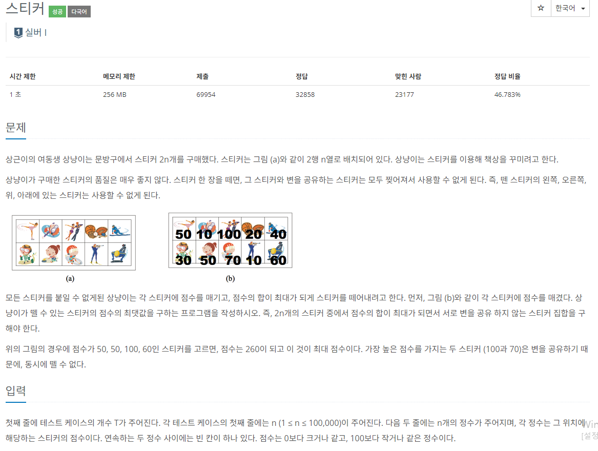

### 문제 해결
- 한 스티커를 떼어내면 상하좌우 스티커를 뗄 수 없다는 것을 주의 하고 알고리즘을 생각하였다.
- 해당 문제의 경우의 수를 생각하다보면
```
* 문제 예시 상황
50  10  100  20  40
30  50  70   10  60
```
- 위 상황에서 왼쪽부터 스티커를 선택한다면 바로 상하좌우에 있는 스티커만 고려하면 안된다.
- 수평으로 2칸 떨어진 스티커까지 고려해야한다.
- 예를 들어, 50-50-100 다음에 10을 선택하는 것보다 2칸 떨어진 60을 선택하는 것이 더 큰 값을 얻을 수 있다.
- 나는 botton-top 방식으로 초기 2열 값을 넣어준뒤 값을 구했다.