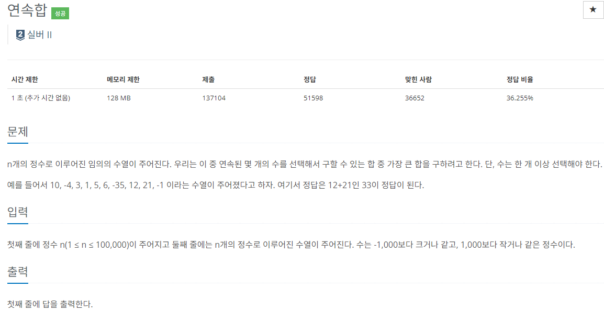

### 문제 해결
- 이문제는 연속된 수열의 합이 가장 큰 경우를 구하는 문제이다. 정확히는 연속된 수열의 합의 최대값을 구하는 것이다.
- 가장 긴 증가하는 부분 수열과 비슷한 문제이다.
- 위 문제는 길이의 최대값을 `dp[]`에 기록하면서 계산하는 것이고, 이 문제는 `dp[]`에 합의 최대값을 기록하면서 계산하는 것이다.
- 하지만 문제 알고리즘이 정확히 이해가 되지않아 인터넷을 찾아보았다.