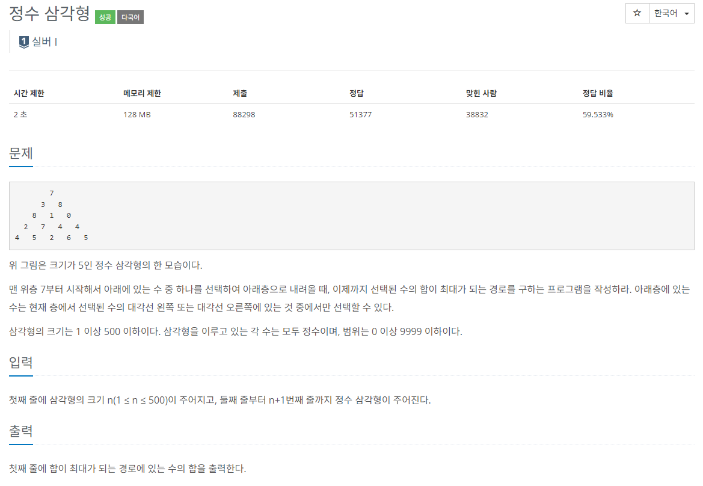

### 문제 해결
- 해당문제는 이전에 조합문제를 푸는 과정이 비슷했다. 
- 문제에서 제시한 예시에서 위에서 오른쪽, 왼쪽중 더 큰값을 가져와 더한값중에 가장 큰값을 구하는 문제이다.
- 나는 이 문제를 top-button 알고리즘으로 해결하였다. 
- 맨 아래에서 부터 위 오른쪽, 왼쪽중 큰값을 가져와 자신의 값을 더하면 되는 간단한 문제였다.
- 해당 삼각형 값들을 배열에 담아 구현하였다.