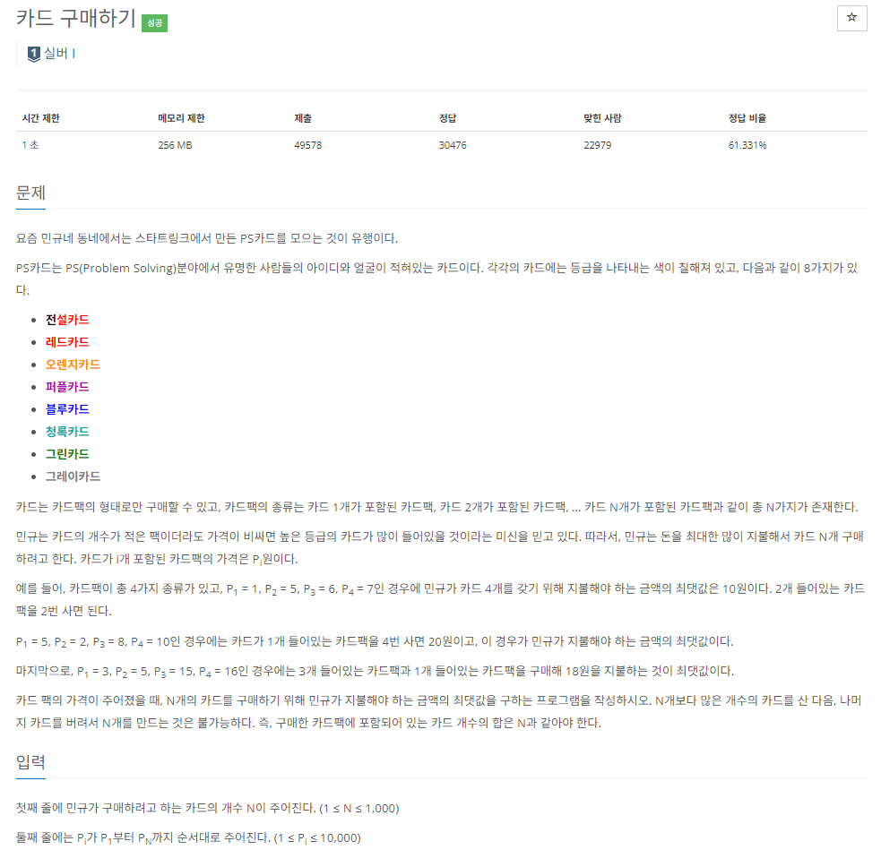

### 문제 해결
- 해당문제는 DP 문제이므로 작은 문제로 나누어서 생각을 해보았다.
- 만약 하나의 카드팩을 고른다면, 해당 카드팩 구매비용 + 나머지 카드개수에서 구할 수 있는 최대 비용
- 즉, i번째 최대비용은 선택한 j(개수)번째 카드팩 비용 + 카드 i-j개를 구하는 최대 비용
- `dp[i]= card[j] + dp[i-j]`라는 기본 점화식을 가지고 구현하였다.