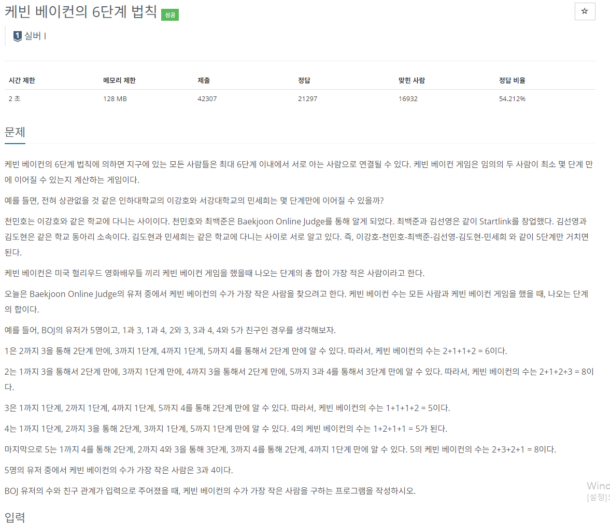

### 문제 해결
- LinkedList[]로 각 인덱스가 사람이라고 생각
- 해당 배열에도 new LinkedList<>()를 생성 후 연결되어 있는 사람을 적는다
- 이때, 양방향이므로 다른 인덱스(사람)에서도 연결되는 사람을 추가한다.
- 그리고 각각 BFS를 통해 다른 사람들과의 거리를 계산하였다.
- Integer[] visited를 통해 처음에 시작하는 사람은 0, 이웃하는 사람은 1, 이렇게 +1을 하면서 각 사람들까지의 거리를 계산