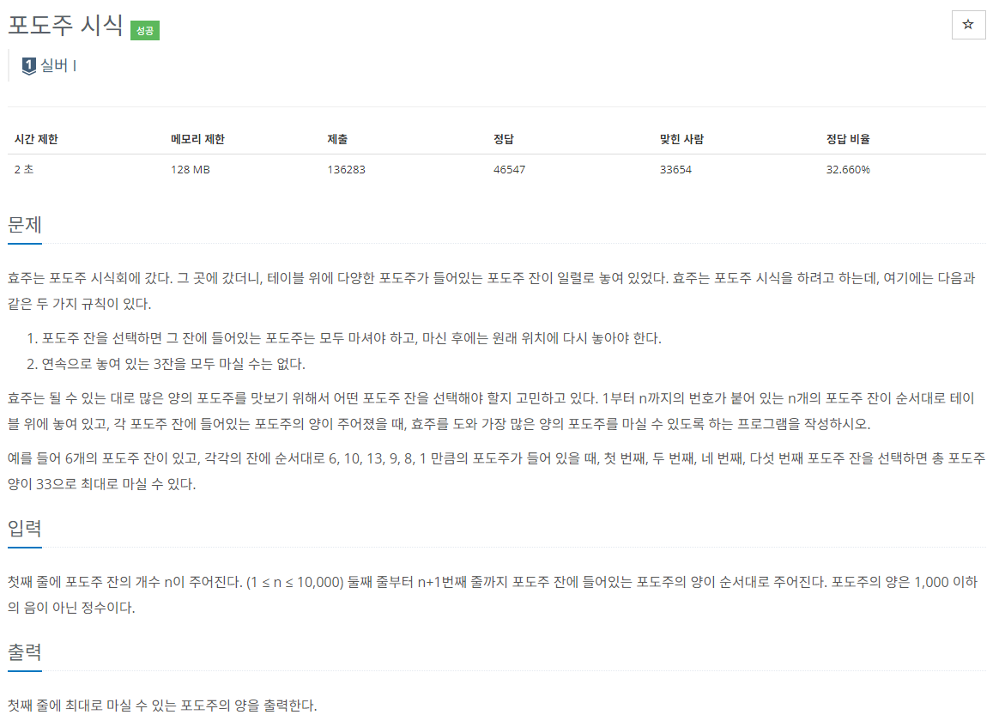

### 문제 해결
- 해당 문제는 전형적인 동적프로그래밍 문제라고 생각된다. 
- 문제에서 나오는 상황을 살펴보면 
>       6    10    13    9    8    1
>                   o    x    o    o   => 1번
>                   o    o    x    o   => 2번
>       o     o     x    o    o    x   => 3번 

연속 3잔은 마실 수 없다는 조건을 고려하면 마지막 부분이 위 3가지 경우가 생긴다.

3번: dp[n-1] / 2번: dp[n-2]+arr[n] / 1번: dp[n-3]+arr[n-1]+arr[n]
```
dp[n] = Math.max(DP(n - 1), Math.max(DP(n - 2) + arr[n], DP(n - 3) + arr[n - 1] + arr[n]));
```

