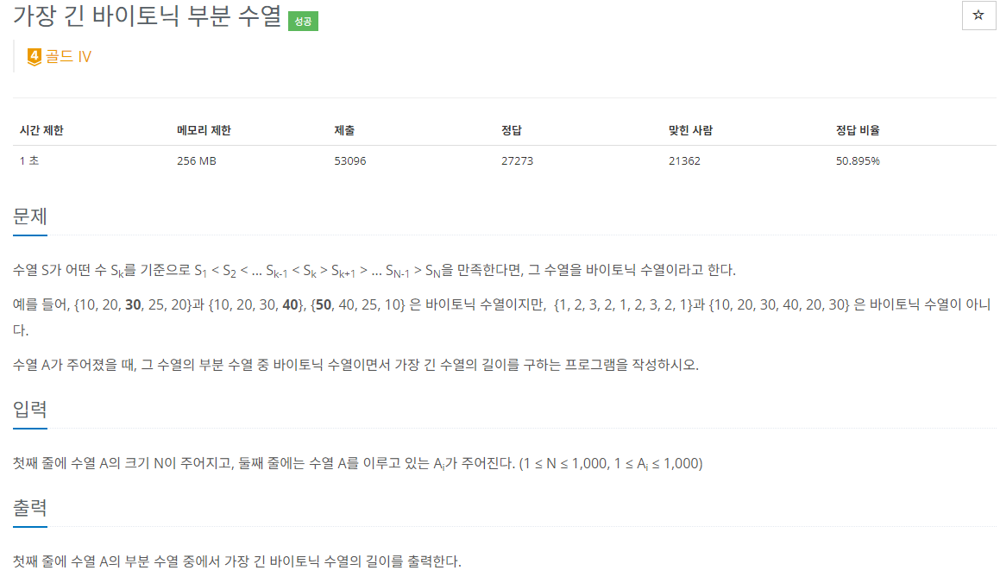

### 문제해결
- 증가하다가 감소하는 부분 수열 중 가장 긴 수열을 구하는 문제이다.
- 설명을 들으니 LIS(가장 긴 증가하는 부분 수열)이 생각이 났다.
- 방법은 증가하다가 감소하는 수열 중 해당 기준이 되는 수를 for문으로 돌아가면서 각각 앞쪽 LIS, 뒤쪽 LIS를 구했다.
- 구한 값들의 합이 가장 큰 값이 정답이다.
- 하지만 고려해야할 부분이 존재한다.
```text
기준이 되는 수의 값이 나눴을 때 앞쪽에 존재한다면, 컴퓨터는 수열을 하나 더 읽는다.
    -  예를 들어 1 3 5 5 3 2 에서 index=4인 수가 기준이라면,
     1 2 5 / 5 3 2 로 나누었을때, 앞 쪽의 5는 원래라면 무시되는 값이지만 나눠지면서 의미 있는 값이 되어버렸다.
    - 그래서 if(seq[num] == seq[i]) continue; 을 추가하여 같은 값이면 무시하면서 해결하였다.
```

### 가장 긴 증가하는 부분 수열
```
int[] dp = new int[N];
for(int i=0;i < N;i++){
    dp[i] = 1;
    for(int j=0;j < i;j++){
        if(seq[j] < seq[i] && dp[i] < dp[j]+1){
            dp[i] = dp[j] + 1;
        }
    }
}
int max = 0;
for(int i=0;i < N;i++){
    max = Math.max(dp[i], max);
}

```