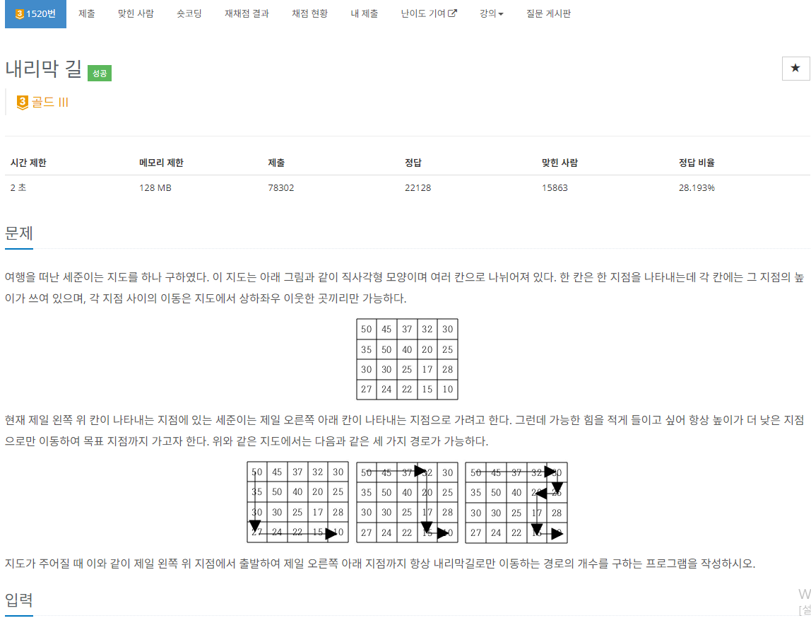

## 문제 해결 방법
- DFS로 경우의 수를 구하려했으나 시간초과 -> 중복된 계산을 줄이기 위해 dp[][] 생성
- 목적지까지 도달 할 수 있는 경우의 수에 대한 부분 정보를 dp[][] 다이나믹 프로그래밍 기법으로 다음 방문시 이를 참조
> 예를 들어) (1,1)에서 (10,10)으로 가야할때,
> - 만약, (3,3)에서 (10,10)으로 가는 길은 4개이다.
> > (1,1)에서 길을 찾다가 (3,3)을 만났을때 위 정보를 알기때문에 불필요한 계산을 줄일 수 있다.

## 회고
- 처음에 그냥 DFS만하면 쉽게 구할 수 있다고 생각했음, 하지만 gold 3 + 정답률 28%.. 
- 백퍼 시간초과 or 메모리 초과로 실패할 것 같았음
- 시간 복잡도를 계산해봄.. -> N,M의 범위가 500 DFS의 시간 복잡도는 N = 2500000 O(N+e)인줄 알고 그냥 구현하였으나..
- 한번 탐색하는 것이나 최소 거리를 구하는 것이 아니라 갈 수 있는 모든 경우의 수이기때문에 시간초과가 되엇다.
- 오랜만에 DP를 이용하다보니 헷갈린다. 중간에 `if(dp[y][x] != -1){
  return dp[y][x];
  }` 부분에 대한 이해가 애매하다 주말에 한번 더 풀어보겠다.