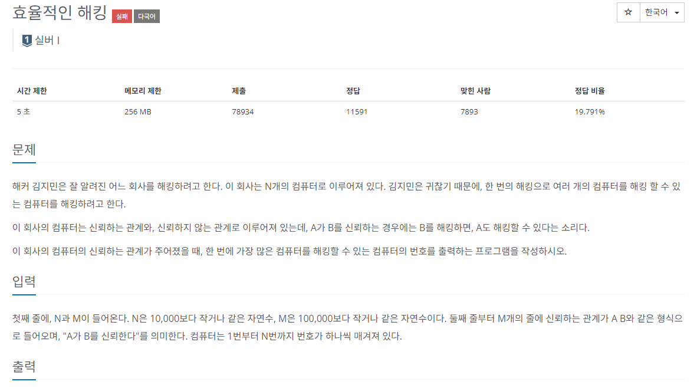

### 문제해결
- 신뢰관계를 토대로 graph를 구현한다.(LinkedList<Integer>[] 타입)
- 단방향 그래프사용
- 시작 정점을 돌아가면서 해킹가능한 컴퓨터수를 구함(BFS or DFS)
- 최대 해킹가능한 컴퓨터수를 가지는 시작 정점을 구한다.
> 시간초과로 실패
> - 시간복잡도를 계산해보았을때 시간 제한 5초는 안넘길 것같아서 진행하였으나..
> - O(N+e) /  N = 10000 * 10000 = 10^8 이라고 생각했는데 아니였나..
> - 구글에 해당 문제를 검색해 보았을때 내 코드랑 비슷한 코드가 있었는데 그 사람은 통과했다고 한다.
> - 해당 문제는 데이터를 추가하면서 기존에 성공한 사람도 시간초과로 실패했다고 한다.
- 추가된 데이터를 성공했다는 블로그를 보고 해당 알고리즘을 구현하였으나.. 역시나 시간초과로 실패
- 내가 해당 코드를 잘못 적용했다는 생각으로 한번 성공했다는 블로그 코드를 백준에 제출해 보았으나 시간초과로 실패..
- ??? 어케품.. 일단 한문제로 너무 오래 끌고 있는건 별로가서 패스..