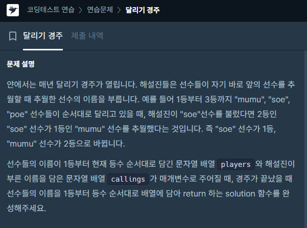

### 문제 해결
- 특별한 알고리즘을 사용했다기 보다는 기본 구현 문제 or 자료구조문제 같다.
- 나는 처음 들어오늘 players배열, 처음 순서를 Map에 담았다.
```
Map<String, Integer> map = new HashMap<>();
key : player 이름
value : 현재 순위
```
- 그리고 callings배열에서 부른 이름 순서대로 players배열값, 과 현재 순위를 담고 있는 map을 변경
- 여기서 map을 활용하여 이름으로 즉시 변경할 수 있어 효율적인 검색 & 변경이 되었다.

