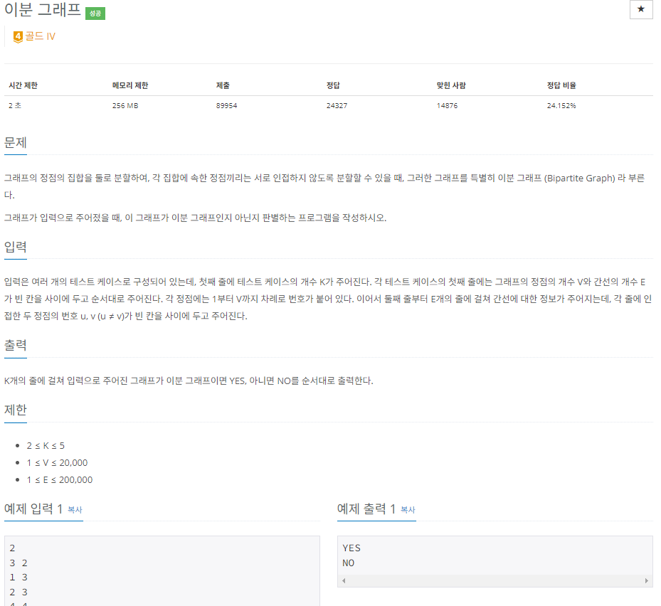

## 문제 해결 방법
- 이 문제를 해결하려면 이분 그래프에 대해서 이해를 해야한다. 문제에서 그래프 정점의 집합을 둘로 분할하여, 각 집합에 속한 정점끼리는 인접하지 않도록!
- 위 내용을 중점으로 문제를 해결하려면 그래프를 탐색할때 현재 탐색중인 정점(V)과 인접한 정점을 다른 집합으로 구분하면 된다.
- 즉, 나같은 경우는 `char set[] = new set[V+1]`로 해당 배열의 인덱스는 정점을 나타내고 해당 값은 집합을 넣었다.
- 집합은 A / B로 나웠으며 탐색하다가 다음 정점의 집합이 이미 설정되어있고 현재 정점의 집합과 같다면 그래로 `fasle`를 return한다.

## 회고
- 집합을 나누는 과정에서 `char[]`에 A , B를 넣어서 구분 하였는데
- `int[]`형에 1 과 -1로 구분한다면 초기화할때 0으로 설정되고 두 집합을 비교할때 현재 집합에서 ( * -1)을 한다면 좀더 코드가 간결하고 좀더 코드를 작성하기 편했을것이다.
- `char[] set = new char[N]`로 초기화를 한다면 set[0~N-1]에는 `'\0'`값으로 초기화되는 것을 알게 되었다.
