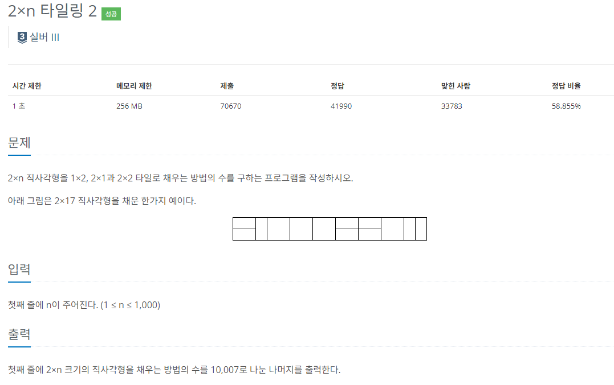

### 문제 해결
- 이 문제는 이전에 풀었던 타일링 2 * n의 2번째 버전이다.
- 이전 문제보다 추가사항이 하나 늘었는데, 바로 2*2가 있다는 것이다.
- 해당 문제도 점화식을 구해서 적용하면 간단한 문제였다.
- 하지만 점화식을 구하는 것이 어려웠다...
- 해당 점화식은 dp[n] = dp[n-1] + 2*dp[n-2]이다.
- 이전 문제에서 2*2가 추가 되었는데 이 타일은 2*1 2개 or 1*2 2개와 같다는 것이 생각해서
- dp[n-2]를 더할때 곱하기2를 하였다.