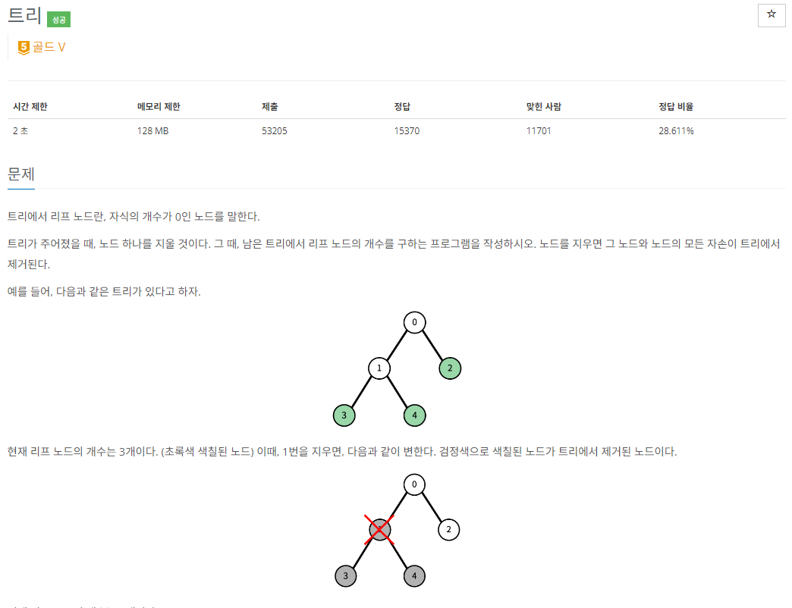

- 입력받은 숫자를 토대로 그래프를 만든다 -> LinkedList[] 타입(배열 인덱스가 노드)
- 제거할 노드를 지정한 후, 시작 노드(-1 입력받은 노드 인덱스)로 DFS
- DFS탐색후 이후에 자식 노드(LinkedList 타입)가 없을때 count++ 후 return(종료)
- 만약, 제거할 노드라면 탐색하지 않는다. -> continue
- 위와 같이 진행하였으나 틀렸음,,, 
- 예외 케이스를 좀더 생각해봄 -> 만약 DFS 탐색중 다음 노드가 있지만 제거할 노드라면 그대로 for문을 탈출해 버리는 상황이 발생
- 그래서 종료 상황에 위 내용을 디테일하게 추가
- =>  `(graph[node].size() == 1 && graph[node].get(0) == removeNode)` 추가
- 제출시 성공
- 예외케이스를 좀더 생각하자, 처음에 알고리즘을 설계할때 쉬운 것 같아서 조금 소홀하게할시 이런 상황이 발생하는 것 같다. 